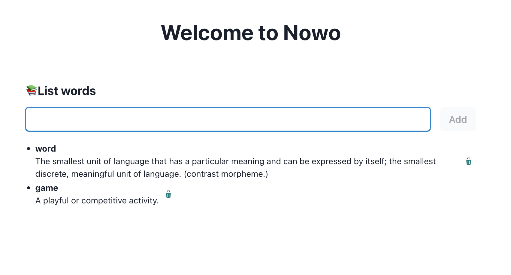

# Nowo - Desktop application




## Feature
- Electron.js
- Typescript
- Charka UI
- Zustand


## Install

Install dependencies:

```bash
npm install
```

## Starting Development

Start the app in the `dev` environment:

```bash
npm start
```

## Packaging for Production

To package apps for the local platform:

```bash
npm run package
```
